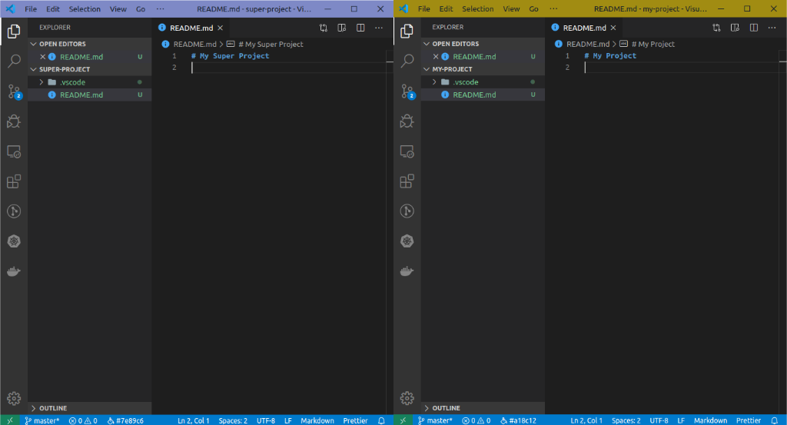
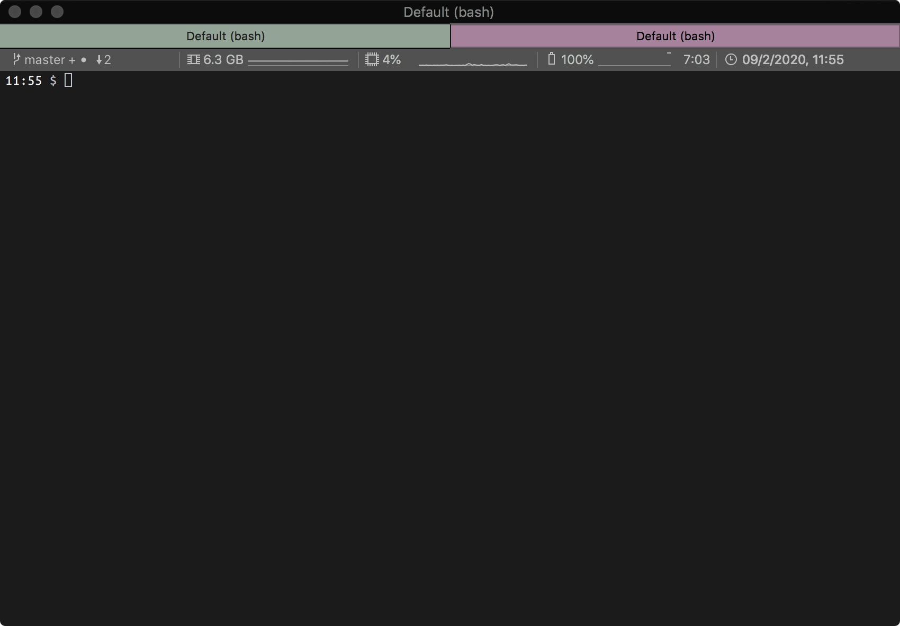

# Various utilities to improve our workspace.

## Workspace customizations based on the current git repository

This has been tested on Ubuntu 18.04 and macos 10.13, should work with python 2/3.

Python script to automatically customize the workspace based on the current git repository root path (credits to [iterm2-ssh-color](https://nvbn.github.io/2017/10/11/iterm2-ssh-color/) for iTerm2 tab coloring function).

### Project motivation

I frequently find myself with 6+ projects (for me means git repositories) open concurrently, I created a couple of utilities to manage all this more easily.

### Installing

Clone repository:

```sh
git clone https://github.com/meddario/workspace-utils.git ~/.workspace-utils
```

Add in `~/.bashrc`:

```bash
# Workspace customizations based on the current git repository
export PROMPT_RUNNER_DIR=~/.workspace-utils
source $PROMPT_RUNNER_DIR/workspace-utils.sh
export PROMPT_COMMAND="$PROMPT_COMMAND;customizeWorkspace"

```

### Example configuration

Add to `$HOME/.workspace-utils.json` (customizations must be explicitly enabled):

```json
{
  "customize_workspace": {
    "update_vscode_peacock_config": true,
    "update_iterm_tab_color": true
  }
}
```

### Available customizations

* `update_vscode_peacock_config`: requires [vscode Peacock extension](https://marketplace.visualstudio.com/items?itemName=johnpapa.vscode-peacock), automatically sets the peacock color in the `.vscode/settings.json`.
* `update_iterm_tab_color`: updates the current iTerm tab color to the repo color.

### Example results

`update_vscode_peacock_config`:



`update_iterm_tab_color`:


